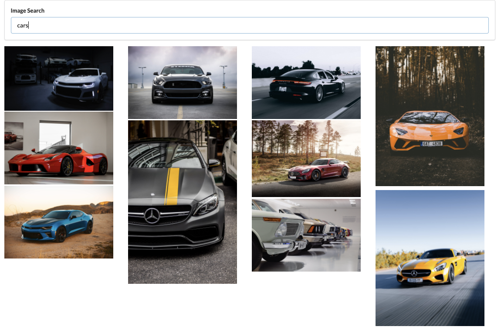

## Image Serach App

Image Serach App take search term from the user and fetch data from external API(Unsplash) and render images in the adaptive grid layout.
This App is created using html, css, and React(javascript framework).

## Screenshot:

## Topics Covered

- React Framework
- React Components
- React State
- JS Modules
- JS Higher Order Function: Map
- CSS: Grid Layout
- Adaptive Grid based on Image size

## Run this on your computer

1. First create developer account on Unsplash using this link: https://unsplash.com/documentation

2. Get your own Client-ID key for Unsplash API.

3. Inside 'src/api/unsplash.js' insert your Client-ID as a value to the property of 'Authorization'.

4. Now run the following scripts.

## Available Scripts

1. First Install NPM by typing: `npm install` in your terminal.

2. Now Run: `npm start` to start app in your local server.

3. Open [http://localhost:3000](http://localhost:3000) to view it in the browser.
